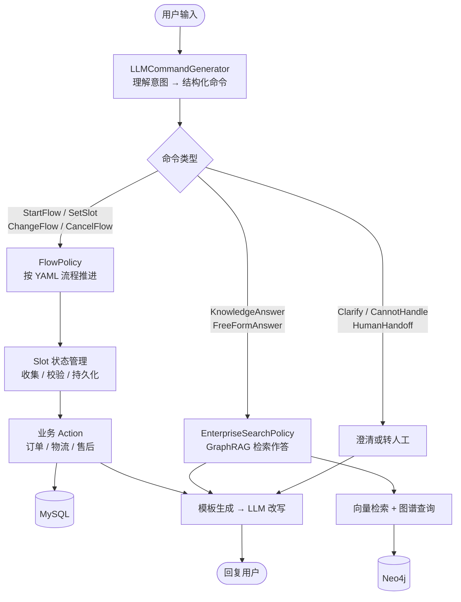

# LLM Customer Service

> 电商智能客服系统。基于 CALM 架构（Conversational AI with Language Models）自研的
> 对话框架 + 电商业务实现：大模型只负责把用户意图翻译成结构化命令，
> 业务流程由确定性的 Flow 引擎执行；知识类问题走 GraphRAG 从 Neo4j 图谱检索作答。


<!-- 录好演示 GIF 后，把下面这行的注释符去掉即可 -->
<!--  -->

---

## 这个项目解决什么问题

把电商客服直接交给大模型自由发挥，会立刻撞上三堵墙：

**流程不可控。** 退款有严格前置条件——订单状态、签收时间、是否已发起过售后。
模型凭语感判断，早晚会给不该退的订单批退款。

**状态会丢。** 多轮对话中用户改口（「不对，我说的是另一个订单」），
纯 Prompt 方案没有显式的槽位状态，只能靠模型自己从历史里重新推断，轮次一多必然出错。

**幻觉有成本。** 用户问运费规则，模型编一个看似合理的数字，用户照着算完下单，
客诉就来了。

CALM 架构的思路是**把理解和执行分开**：

| 真实场景的难点 | 本项目的应对 |
| --- | --- |
| 业务流程必须严格可控 | 流程写在 YAML Flow 里由引擎执行，模型无权跳过步骤 |
| 多轮对话状态易丢失 | 显式槽位（Slot）存储，支持跨流程持久化与按需重置 |
| 用户中途改主意、插话 | 命令体系覆盖流程切换、取消、澄清、重启等 18 种情形 |
| 知识类问题容易编造 | 走 GraphRAG 从 Neo4j 检索后作答，无检索结果则移交人工 |
| 模型答不了的情况 | `CannotHandleCommand` / `HumanHandoffCommand` 显式兜底 |
| 回复模板生硬 | 模板生成后经 LLM 改写润色，兼顾可控与自然 |

---

## 系统架构

### 核心思想：LLM 产出命令，而非产出动作



模型的输出不是一段回复，而是一串**命令**——`StartFlow(查询订单详情)`、
`SetSlot(order_id, "20250318001")`。命令交给策略层执行，
流程的每一步都由 YAML 定义好，模型无法越过。

这样做的代价是模型不能自由发挥，收益是**行为可预测、可测试、可审计**。
客服场景下这笔交易非常划算。

### 命令体系（18 种）

| 分类 | 命令 |
| --- | --- |
| 流程控制 | `StartFlow` `ChangeFlow` `CancelFlow` `Restart` `SessionStart` |
| 槽位操作 | `SetSlot` `ResetSlot` |
| 回答类 | `KnowledgeAnswer` `FreeFormAnswer` `ChitChatAnswer` |
| 兜底与异常 | `Clarify` `CannotHandle` `HumanHandoff` `Noop` |
| 错误处理 | `ErrorCommand` `ParseError` `InternalError` |

覆盖「用户中途改问别的」「问题太模糊需要澄清」「超出能力范围要转人工」
这些真实对话里高频出现、而纯 Prompt 方案往往处理不好的情形。

---

## 技术栈

| 分层 | 选型 |
| --- | --- |
| 对话理解 | `LLMCommandGenerator`——把自然语言翻译成结构化命令 |
| 策略层 | `FlowPolicy`（流程驱动）+ `EnterpriseSearchPolicy`（知识问答）+ `PolicyEnsemble`（仲裁） |
| 对话编排 | LangGraph（`agent/builder.py` 构图，`agent/edges.py` 定义流转） |
| 知识检索 | GraphRAG：BGE-base-zh-v1.5 向量召回 + Neo4j 图谱关系查询 |
| 状态存储 | Slot 机制，支持 JSON 与 MySQL 两种后端 |
| 回复生成 | 模板 NLG + LLM 改写（`response_rephraser`） |
| 大模型 | 通义千问（DashScope），OpenAI 兼容接口 |
| 业务数据 | MySQL（订单、物流、售后） |
| 接入通道 | Console / REST / Inspect 调试代理 |

---

## 快速开始

### 1. 准备依赖服务

```bash
# Neo4j（GraphRAG 图谱库）
docker run -d -p 7474:7474 -p 7687:7687 --name neo4j \
  -e NEO4J_AUTH=neo4j/your_password neo4j:5

# MySQL 需自行准备，并创建 ecs 库
```

### 2. 安装与配置

```bash
pip install -e .
cd ecs_demo
cp .env.example .env
```

编辑 `.env`：

```ini
DASHSCOPE_API_KEY=your_api_key_here
EMBEDDING_MODEL=./models/bge-base-zh-v1.5

ECS_DB_HOST=localhost
ECS_DB_PORT=3306
ECS_DB_NAME=ecs
ECS_DB_USER=your_mysql_user
ECS_DB_PASSWORD=your_password_here

NEO4J_URI=bolt://127.0.0.1:7687
NEO4J_USERNAME=neo4j
NEO4J_PASSWORD=your_password_here
```

> 仓库内不含任何真实密钥，全部凭据经环境变量注入。
> Embedding 模型权重约 390MB，超过 GitHub 单文件上限，不入版本库，
> 需自行下载到 `ecs_demo/models/` 目录。

### 3. 初始化数据

```bash
python gen_data.py                      # 生成订单、物流、售后测试数据
python addons/create_indexing.py        # 建立 Neo4j 索引与约束
```

### 4. 训练与运行

```bash
atguigu-ai train        # 训练流程检索器
atguigu-ai shell        # 命令行对话
atguigu-ai run          # 启动 REST 服务
atguigu-ai inspect      # 可视化调试：查看每轮产出的命令与槽位变化
```

---

## 项目结构

```
├── atguigu_ai/                     # 自研对话框架
│   ├── dialogue_understanding/     #   命令生成：自然语言 → 结构化命令（18 种）
│   ├── policies/                   #   策略层：流程策略、企业检索策略、策略仲裁
│   ├── agent/                      #   LangGraph 编排：构图、边、动作执行
│   ├── core/                       #   领域模型、槽位管理、状态存储（JSON / MySQL）
│   ├── retrieval/                  #   向量化与流程检索
│   ├── nlg/                        #   模板生成 + LLM 改写
│   ├── training/                   #   训练数据生成、同义改写、模型持久化
│   ├── channels/                   #   接入通道：Console / REST / Inspect
│   ├── cli/                        #   命令行：train / run / shell / inspect / export / init
│   └── shared/                     #   配置、常量、异常、基础客户端
└── ecs_demo/                       # 电商客服业务实现
    ├── data/flows/                 #   流程定义：订单 / 物流 / 售后
    ├── domain/                     #   领域定义：槽位、响应、模式
    ├── actions/                    #   业务动作与数据访问
    ├── addons/                     #   GraphRAG 检索、图谱索引构建
    └── config.yml                  #   Pipeline 与策略装配
```

---

## 工程实践

- **理解与执行解耦**：模型只产出命令，不直接决定业务动作。流程逻辑集中在 YAML 中，改业务规则不需要改代码，也不需要重新调提示词。
- **槽位持久化控制**：`persisted_slots` 声明哪些槽位跨流程保留（如 `user_id`），其余流程结束即重置，避免上一轮的订单号污染下一轮。
- **策略仲裁**：`PolicyEnsemble` 在多个策略都能响应时按优先级裁决，而不是让它们各自输出后拼接。
- **配置化装配**：`config.yml` 声明 pipeline 与 policies，包括 GraphRAG 作为向量存储的注入，替换检索实现不必改动框架代码。
- **可视化调试**：`inspect` 通道把每轮的命令、槽位变化、流程栈暴露出来——对话系统最难排查的就是「模型到底理解成了什么」，这个工具直接把中间态摊开。
- **凭据全外部化**：数据库与图谱的用户名、密码、连接地址一律经环境变量注入，代码中不含任何明文凭据。

---

## 评测结果

> 🚧 评测体系建设中，指标将在此处更新。

对话系统的评测需要分层进行，计划覆盖：

| 层级 | 指标 |
| --- | --- |
| 命令生成 | 命令类型准确率、槽位抽取准确率 |
| 流程执行 | 流程完成率、非法跳转次数 |
| 知识问答 | GraphRAG 检索命中率、无依据作答率 |
| 兜底能力 | 超范围问题是否正确转人工而非硬答 |

---

## Roadmap

- [ ] **评测体系**：构建多轮对话测试集，覆盖正常流程、中途改口、超范围提问三类场景
- [ ] **命令生成少样本优化**：为易混淆的命令对补充示例，降低 `Clarify` 误触发
- [ ] **GraphRAG 召回优化**：当前为纯向量召回，补充图谱多跳关系检索
- [ ] **会话状态持久化**：JSON 存储改为 MySQL，支持服务重启后恢复对话
- [ ] **流程覆盖扩展**：补充发票、换货、价保等高频客服场景
